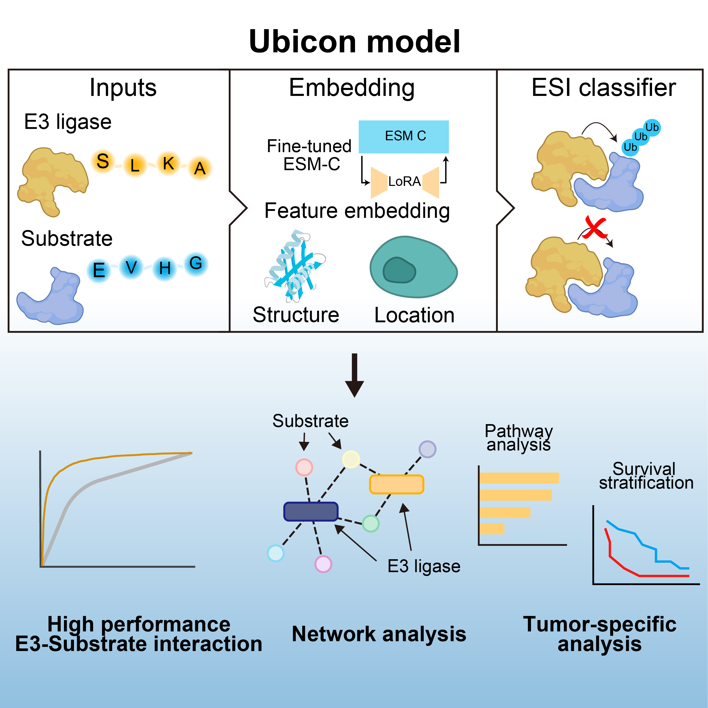

# Ubicon: E3 Ligase-Substrate Interaction Prediction

Ubicon is a machine learning-based tool designed to predict interactions between E3 ligases and their substrate proteins. It combines sequence, structural, and subcellular localization features to provide accurate predictions of potential E3-substrate pairs.

## Overview

Protein ubiquitination is a crucial post-translational modification that regulates various cellular processes, including protein degradation, trafficking, and signaling. E3 ubiquitin ligases are key enzymes that determine the specificity of ubiquitination by recognizing specific substrate proteins. Predicting these E3-substrate interactions is important for understanding cellular regulation and potentially for developing therapeutics targeting the ubiquitin system.

Ubicon leverages multiple types of protein information:
- Sequence features (using ESM-C)
- Subcellular localization (using DeepLoc2)
- Structural information (using Foldseek's 3Di representation)

By integrating these complementary data types, Ubicon achieves high accuracy in predicting novel E3-substrate interactions.





## Installation
### Setup

1. Clone this repository:
```bash
git clone https://github.com/shimizu-team/ubicon.git
cd ubicon
```
2. Construct environment:

You can set up the required environment using the `environment.yml` file:

```bash
conda env create -f envorionment.yml
conda activate ubicon
```


3. Pre-trained model files are already included in the repository's `models` directory:
   - `final_catboost_model.cbm`
   - `isotonic_calibration_model.pkl`

## Usage

### Quick Start

The simplest way to use Ubicon is through the provided Jupyter notebook tutorial (`tutorial.ipynb`)


### Input Files

Ubicon requires FASTA sequences for E3 ligases and potential substrate proteins:

1. **E3 ligases**: FASTA file with UniProt formatted headers
2. **Substrates**: FASTA file with UniProt formatted headers

For example, the `examples` directory contains the following sample data:
- `E3.fasta`: Sample E3 ligase sequences
- `Substrate.fasta`: Sample substrate sequences

#### Sequence Embeddings

Sequence embeddings are generated using a fine-tuned ESM-C model:

```bash
python embedding.py --E3_seq_file examples/E3.fasta --Sub_seq_file examples/Substrate.fasta
```

After execution, embeddings are saved to the `results/[timestamp]_embedding/` directory.

#### Structure Embeddings

Structure embeddings are generated using Foldseek. This process requires obtaining protein structures (e.g., from AlphaFold) and running Foldseek's createdb command to extract the 3Di structural alphabet.

Sample structure embeddings are included in the `examples` directory:
- `E3_structure_embed.json`
- `Sub_structure_embed.json`

#### Localization Information

Subcellular localization information can be predicted using DeepLoc2. DeepLoc2 can be accessed through their [web server](https://services.healthtech.dtu.dk/services/DeepLoc-2.0/) or [GitHub repository](https://github.com/TviNet/DeepLoc-2.0).

Sample localization embeddings are included in the `examples` directory:
- `E3_location_embedding.csv`
- `Sub_location_embedding.csv`

### Command Line Prediction

Ubicon also provides a command-line interface for making E3-substrate interaction predictions directly:

```bash
python predict.py --e3_id <E3_UNIPROT_ID> --substrate_id <SUBSTRATE_UNIPROT_ID>
```

#### Required Arguments:
- `--e3_id`: UniProt ID of the E3 ligase
- `--substrate_id`: UniProt ID of the substrate protein

#### Optional Arguments:
- `--config`: Path to configuration file with feature file paths (default: config/default_paths.json)
- `--output`: Path to save prediction result as CSV (optional)

#### Example:
```bash
# Predict interaction between VHL (P40337) and HIF-1α (Q16665)
python predict.py --e3_id P40337 --substrate_id Q16665

# Use custom configuration file
python predict.py --e3_id P40337 --substrate_id Q16665 --config my_config.json

# Save result to CSV file
python predict.py --e3_id P40337 --substrate_id Q16665 --output results/vhl_hif1a.csv
```

#### Configuration File Format:
The configuration file should be a JSON file specifying the paths to feature files:

```json
{
  "e3_embedding": "examples/E3_feature_embedding.pt",
  "substrate_embedding": "examples/Sub_feature_embedding.pt",
  "e3_structure": "examples/E3_structure_embed.json",
  "substrate_structure": "examples/Sub_structure_embed.json",
  "e3_location": "examples/E3_location_embedding.csv",
  "substrate_location": "examples/Sub_location_embedding.csv",
  "model_path": "models/final_catboost_model.cbm",
  "calibration_path": "models/isotonic_calibration_model.pkl"
}
```

This approach allows users to quickly predict interactions for specific protein pairs without writing any code or using Jupyter notebooks.

#### Output Explanation:

The command outputs both the raw prediction score and the calibrated Ubicon score:

```
===== Prediction Result =====
E3 ligase: P40337
Substrate: Q16665
Ubicon score: 0.878049
====================
```

The Ubicon score is calibrated using an isotonic regression model to improve interpretability. Scores closer to 1.0 indicate a higher likelihood of interaction between the E3 ligase and substrate.

## Directory Structure

```
ubicon/
├── src/ - Source code
│   ├── model_setting.py - Model configuration
│   ├── score_utils.py - Score calculation utilities
│   ├── model_lora.py - LoRA model implementation
│   ├── dataset_lora.py - Dataset processing
│   └── trainer_lora.py - Training class
├── models/ - Pre-trained models
│   ├── final_catboost_model.cbm - Final CatBoost model
│   └── isotonic_calibration_model.pkl - Isotonic calibration model
├── params/ - Parameter files
│   └── lora_param.pt - LoRA parameters
├── examples/ - Sample data
│   ├── E3.fasta - Sample E3 ligase sequences
│   ├── Substrate.fasta - Sample substrate sequences
│   ├── E3_feature_embedding.pt - E3 feature embeddings
│   ├── Sub_feature_embedding.pt - Substrate feature embeddings
│   ├── E3_structure_embed.json - E3 structure embeddings
│   ├── Sub_structure_embed.json - Substrate structure embeddings
│   ├── E3_location_embedding.csv - E3 localization embeddings
│   └── Sub_location_embedding.csv - Substrate localization embeddings
├── results/ - Results directory
├── tutorial.ipynb - Tutorial notebook
├── embedding.py - Embedding generation script
└── envorionment.yml - Conda environment configuration file
```

## License

This project is licensed under the MIT License. See the LICENSE file for details.

